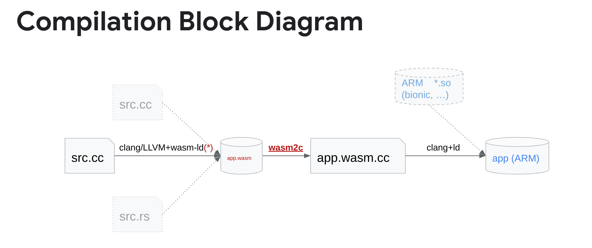
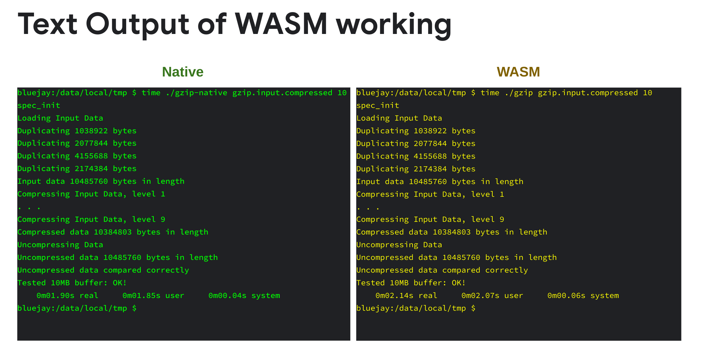
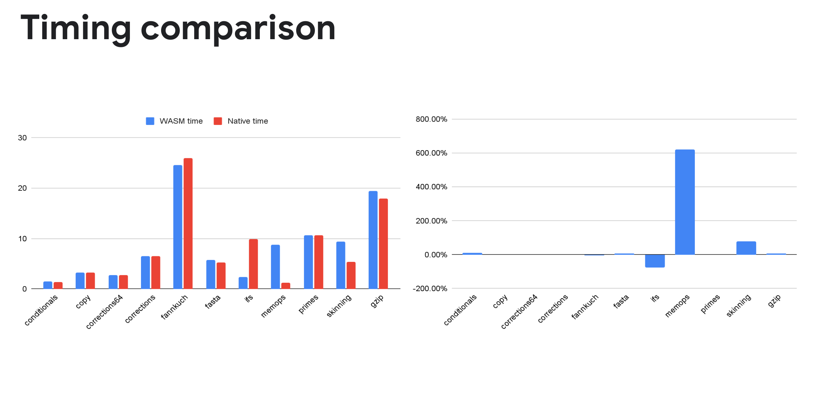
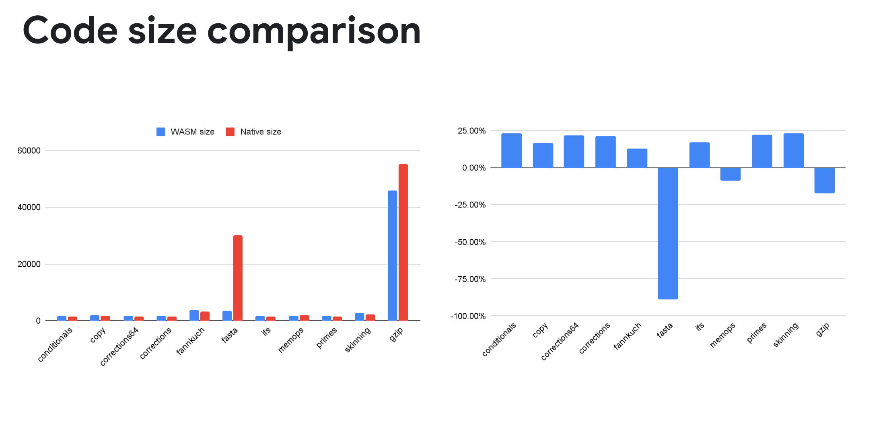

## What is this?

This is temporary repo containing cmake toolchain for compiling
code using Android NDK to WebAssembly.

## Overview



## Current state

We have a working prototype that lets us compile simple micro-benchmarks, the gzip benchmark
from the SPECINT2000 suite, and we have also compiled one of programs from ndk-samples
(`native-plasma`).

### Gzip from SPECINT2000

Gzip running on a Pixel 6a via `adb shell`:



### Timing comparison



### Code size comparison



## Pre-requisites

You will need Android NDK and since at the moment of writing
this NDK toolchain does not support wasm target, - clang
from Andorid OpenSource Project toolchain.

1. Download NDK [here](https://developer.android.com/ndk/downloads)
1. Clone toolchain from this [AOSP git repository](https://android-review.git.corp.google.com/admin/repos/platform/prebuilts/clang/host/linux-x86,general):
   ```
   git clone --depth 1 https://android.googlesource.com/platform/prebuilts/clang/host/linux-x86
   ```
1. Set `ANDROID_NDK_HOME` environment variable to NDK root
1. Set `ANDROID_CLANG_TOOLCHAIN` environment variable to clang toolchain root
   (example: (toolchain repo root)/clang-r487747)

You will also need the forked version of wabt:

1. Clone the fork of wabt from [here](https://github.com/AndroidWasm/wabt)
1. Build the wabt fork by typing `make` in the root of the checkout.
1. Set `WABT_HOME` to the root of the wabt checkout.

## How to use the cmake toolchain

Go to cmake project and execute the following commands
```
mkdir build
cd build
cmake --toolchain $(wasm_ndk_root)/cmake/toolchain/android_wasm.toolchain.cmake ..
cmake --build .
```

## (Optional) How to build android toolchain (in case you need to do some cherry-picks from upstream)

The main document on how to build android llvm toolchain can be found here: https://android.googlesource.com/toolchain/llvm_android/

Before building add upstream remote to android llvm toolchain

```
cd toolchain/llvm-project
git remote add upstream https://github.com/llvm/llvm-project.git
git fetch upstream
```

create a local branch (for `toolchain/llvm-project`)

```
repo start upstream-patches .
```

The android toolchain is usually couple of month behind ToT - so these are cherry pick needed to build compilable wasm binaries

```
git cherry-pick cb5bc756808367d53c870716ce42611a563421e8
```

Use following command while building to exclude windows toolchain and skip tests

```
python toolchain/llvm_android/build.py --no-build windows --skip-tests
```
